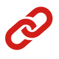

# Over-riding Bootstrap navbar

## HTML template

Start by copying the HTML for the Boostrap navbar with an extra `.navbar-perso` class to over-ride your navbar. You can add the `.navbar-fixed-top` Bootstrap class to fix it on top of your page.


```html
<nav class="navbar navbar-default navbar-perso" role="navigation">
  <div class="container-fluid">
    <!-- Brand and toggle get grouped for better mobile display -->
    <div class="navbar-header">
      <button type="button" class="navbar-toggle collapsed" data-toggle="collapse" data-target="#bs-example-navbar-collapse-1">
        <span class="sr-only">Toggle navigation</span>
        <span class="icon-bar"></span>
        <span class="icon-bar"></span>
        <span class="icon-bar"></span>
      </button>
      <a class="navbar-brand" href="#">
        
      </a>
    </div>

    <!-- Collect the nav links, forms, and other content for toggling -->
    <div class="collapse navbar-collapse" id="bs-example-navbar-collapse-1">


      <ul class="nav navbar-nav navbar-right">
        <li><a href="#">Contact</a></li>
        <li class="dropdown">
          <a href="#" class="dropdown-toggle" data-toggle="dropdown" role="button" aria-expanded="false">Suivez-nous <span class="caret"></span></a>
          <ul class="dropdown-menu" role="menu">
            <li><a href="#"><i class="fa fa-youtube-square"></i> Youtube</a></li>
            <li><a href="#"><i class="fa fa-facebook-square"></i> Facebook</a></li>
          </ul>
        </li>
        <li><a href="#" class="btn btn-primary" id="nav-btn">Publish an announce</a></li>
      </ul>
    </div><!-- /.navbar-collapse -->
  </div><!-- /.container-fluid -->
</nav>
```

Of course, you have to find a logo image.


## CSS template

### Link our stylesheet `navbar.css`

Copy our CSS file `navbar.css` in your website folder and link this stylesheet in your HTML file.

```html
<link rel="stylesheet" href="navbar.css">
```

### How to change your navbar look

#### Navbar height

- Replace `40px` by the height of your choice in all the lines `line-height: 40px;` of `navbar.css`. **Do not to change these values in the media query section** `@media screen and (max-width: 640px)`.

- Change your `#logo` height to the **same line-height you have chosen**.

- Notice that you have a 15px padding (top and bottom) so that your true navbar height will be the size you picked **+30px**. E.g, if you keep 40px as in our initial code your navbar will be **70px = 40px + 30px**


#### Logo size

To change the logo size you can just add extra `padding` to the logo. For instance:

```css
#logo{
  padding: 10px;
}
```

It will automatically resize your logo image.


#### Navbar button

If you have changed your navbar height, you have to adjust your navbar button margin-top.

```css
#nav-btn {
  margin-top: 15px; /* change it depending on you navbar height */
}
```


Of course, feel free to change you button height and background!


#### Drop-down menu

If you have changed your navbar height, you may also have to re-position your dropdown list. For that adjust its `margin-top`

```css
.navbar-nav > li > .dropdown-menu{
  border-radius: 0;
  margin-top: 10px;
}
```


### Go further and share it with us!

In `airbnb.html` and `airbnb.css` (and `mailchimp.html` and `mailchimp.css`), we give you examples of possible customizations.

Feel free to go further and send us your master-pieces

- Twitter: https://twitter.com/lewagonparis
- Facebook: facebook.com/lewagonformation
- Website: http://lewagon.org